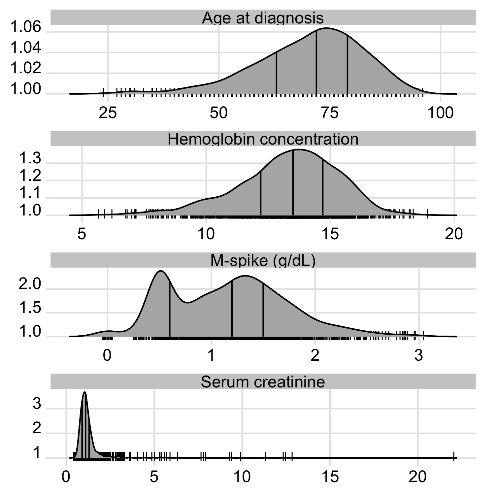

# tableone2.0 ~ Replace Table 1 with fancy ggplots

I dream someday to replace the infamous "Table 1." with better visualizations...
Let's have a go with *ggplot2* and his companion package *ggridges*.
```R
library(survival)
library(tidyverse)
library(ggridges)
mgus2 %>% 
  pivot_longer(names_to="cont_var",values_to="value",-c(id,sex,dxyr,ptime,pstat,futime,death)) %>% 
  mutate(y=1,
         cont_var=(recode(cont_var,
         age="Age at diagnosis",
         creat="Serum creatinine",
         hgb="Hemoglobin concentration",
         mspike="M-spike (g/dL)"))) %>% 
  ggplot(aes(x = value,y=y)) +
  geom_density_ridges(
    jittered_points = TRUE,
    position = position_points_jitter(width = 0.05, height = 0),
    point_shape = '|', point_size = 3, point_alpha = 1, alpha = 0.7,
  )+
  stat_density_ridges(
      geom = "density_ridges_gradient", calc_ecdf = TRUE,
      quantiles = 4, quantile_lines = TRUE
    )+
  theme_ridges()+
  theme(axis.title=element_blank(),axis.title.y=element_blank())+
  facet_wrap(~cont_var,scales="free",ncol=1)
```


Now let's replace the jittered lines with jittered points:
```R
mgus2 %>% 
  pivot_longer(names_to="cont_var",values_to="value",-c(id,sex,dxyr,ptime,pstat,futime,death)) %>% 
  mutate(y=1,
         cont_var=(recode(cont_var,
                          age="Age at diagnosis (years)",
                          creat="Serum creatinine (mg/dL)",
                          hgb="Hemoglobin (concentration (g/dL)",
                          mspike="M-spike (g/dL)"))) %>% 
  ggplot(aes(x = value,y=y)) +
  geom_density_ridges(
    jittered_points = TRUE,
    position = "raincloud",
    point_alpha = 0.2,
    alpha = 0.2,
    scale=0.9
  )+
  stat_density_ridges(
    geom = "density_ridges_gradient", calc_ecdf = TRUE,
    quantiles = 4, quantile_lines = TRUE
  )+
  theme_ridges()+
  theme(axis.title=element_blank(),axis.title.y=element_blank())+
  facet_wrap(~cont_var,scales="free",ncol=2,nrow=2)
```
Adding some spiked histograms:
```R
mgus2 %>% 
  #  summarize_at(vars(var),median,na.rm=TRUE)
  ggplot(aes(x = hgb,y=y)) +
  geom_density_ridges(
#    jittered_points = TRUE,
#    position = "raincloud",
    point_alpha = 0.2,
    alpha = 0.2,
    scale=0.9
  )+
  stat_density_ridges(
    geom = "density_ridges_gradient", calc_ecdf = TRUE,
    quantiles = 4, quantile_lines = TRUE
  )+
  theme_ridges()+
  scale_x_continuous(limits = c(0,22))+
  theme(axis.title=element_blank(),
        axis.title.y=element_blank(),
        axis.text.x = element_blank(),
        axis.text.y = element_blank(),
        axis.line.x = element_blank(),
        axis.ticks.x = element_blank(),
        plot.margin=margin(margin(b=0))) -> p1

mgus2 %>% 
  #  summarize_at(vars(var),median,na.rm=TRUE)
  filter(!is.na(hgb)) %>% 
  ggplot(aes(x = hgb,y=y)) +
  geom_col()+
  theme_ridges()+
  theme(axis.title=element_blank(),
        axis.title.y=element_blank(),
        axis.text.y = element_blank(),
        axis.line.x = element_blank(),
        axis.ticks.x = element_blank())+
  scale_x_continuous(limits = c(0,22)) -> p2
ggarrange(p1,p2,ncol=1,nrow=2,heights = c(4, 1),align="v")
```
Comments and suggestions are appreciated :slight_smile: